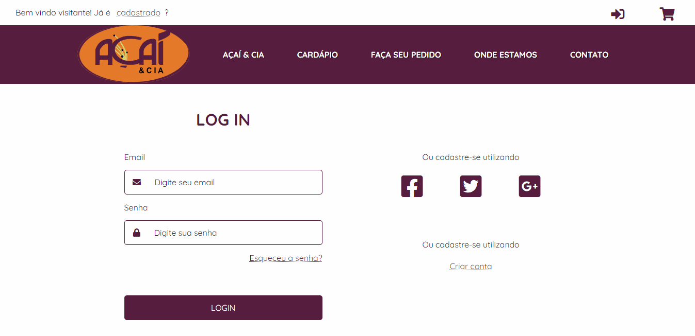

<h1 align="center">
    
</h1>

Site e sistema para delivery da empresa Açaí &amp; Cia

<h4 align="center"> 
	🚧  Site em construção...  🚧
</h4>

    <a href="#sobre">Sobre</a> •
    <a href="#funcionalidades">Funcionalidades</a> •
    <a href="#layout">Layout</a> •
    <a href="#tecnologias">Tecnologias</a> •
    <a href="#autor">Autor</a>

<h3 id="sobre">💻 Sobre o projeto</h3>

A lanchonete Açaí &amp; Cia representa um local tranquilo e reservado para seus clientes na pequena cidade de Rio Acima - MG.
 

Este projeto visa desenvolver para a empresa, uma aplicação web própria para melhorar a exposição de seus produtos e a aproximação com os seus clientes melhorando a entrega por delivery.

<h3 id="funcionalidades">⚙️ Funcionalidades</h3>
 
Usários podem acessar a página para conhecer a empresa e os produtos oferecidos, e também cadastrarem na plataforma web enviando:

- dados pessoais

- endereço de entrega para o delivery

<h3 id="layout">🎨 Layout</h3>
<p">Como a aplicação ainda está em desenvolvimento, segue abaixo, a demonstração das páginas já desenvolvidas.

 
<h3 align="center">Página principal</h3>
<h1 align="center">
    
</h1>
 
<h3 align="center">Página do cardápio</h3>
<h1 align="center">
    
</h1>
 
<h3 align="center">Páginas de login, cadastro e recuperação de senha</h3>
<h1 align="center">
    
</h1>

<h3 id="tecnologias">🛠 Tecnologias</h3>

As seguintes ferramentas estão sendo utilizadas para o desenvolvimento do projeto:

<ul>
    <li><a href="https://reactjs.org/">React</a></li>
    <li><a href="https://nextjs.org/docs">NextJS</a></li>
    <li><a href="https://redux.js.org/">Redux</a></li>
    <li><a href="https://redux-toolkit.js.org/">Redux Toolkit</a></li>
    <li><a href="https://github.com/css-modules/css-modules">CSS Modules</a></li>
</ul>

<h3 id="autor">🦸 Autor</h3>

Yuri Ribeiro Felipe

